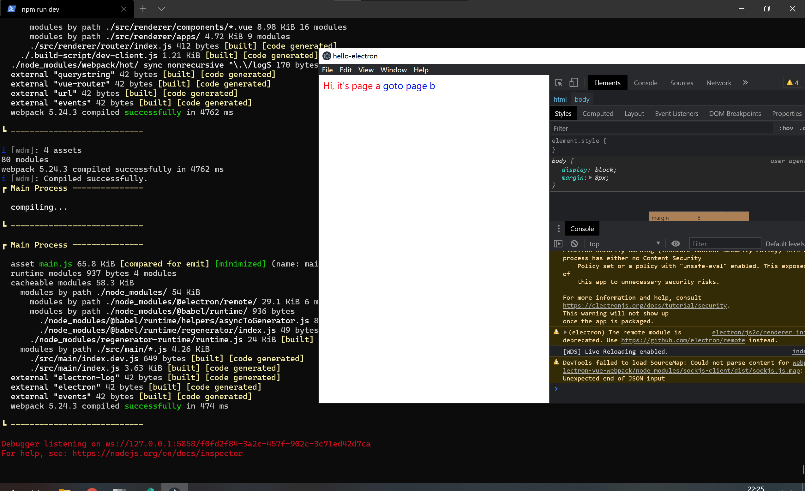

# electron-vue-webpack
An Electron &amp; Vue.js quick start boilerplate 

## Overview

This project was inspired by [SimulatedGREG/electron-vue](https://github.com/SimulatedGREG/electron-vue)

## Key Differences

* Webpack 5+
* Electron 12+
* Babel 7+
* `Code Splitting` enabled by default
* `electron-log` integrated
* multiple BrowserWindows support
* Remove web output support
* Remove default unit testing

## Getting Started

```bash
git clone https://github.com/zerob13/electron-vue-webpack.git
cd electron-vue-webpack
yarn  # or npm install
yarn run dev # or npm run dev
```

## Screenshot


## Apple Silicon Support

* open `.channels/default.json` or whatever channel file your want
* find `mac` -> `arch` 
* add `arm64` as below

```json
  "mac": {
    "icon": "build/icons/icon.icns",
    "target": [
      {
        "target": "dmg",
        "arch": ["x64", "arm64"]
      }
    ]
  }
```